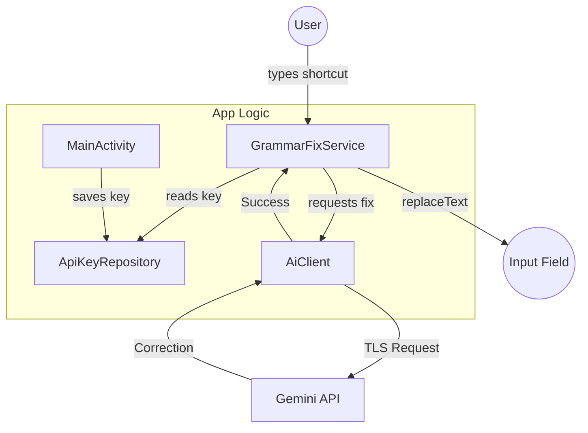

# WordWise Architecture

**Date**: 2026-06-07 (Post-Audit Update)
**App Version**: 1.0 (Targeting SDK 35)
**Project Stats**: 4 Kotlin source files, ~450 lines of code.

## Component Map

| Component | File | Responsibility |
|-----------|------|----------------|
| **MainActivity** | `MainActivity.kt` | Key entry UI, service status monitoring, and accessibility settings linking. |
| **GrammarFixService** | `GrammarFixService.kt` | AccessibilityService lifecycle, shortcut detection, sensitive field filtering, and text replacement. |
| **ApiKeyRepository** | `ApiKeyRepository.kt` | Secure storage of API keys using `EncryptedSharedPreferences`. Single source of truth. |
| **AiClient** | `AiClient.kt` | Singleton object managing the `OkHttpClient` and Gemini API communication. |
| **FixMode** | `AiClient.kt` | Enum defining `SENTENCE`, `PARAGRAPH`, and `ALL` correction modes. |
| **Manifest** | `AndroidManifest.xml` | App permissions, service declarations, and network security references. |
| **Config** | `accessibility_service_config.xml` | Declarative accessibility service properties (event types, flags). |
| **Network Config** | `network_security_config.xml` | Policy for disabling cleartext traffic and defining trust anchors. |
| **ProGuard** | `proguard-rules.pro` | Minification and obfuscation rules for release builds. |
| **Build** | `build.gradle.kts` | Dependency management and build configuration. |

## Architecture Diagram

## Key Design Decisions

- **AccessibilityService**: Chosen to provide system-wide functionality without requiring a custom keyboard implementation. It allows WordWise to work across all apps seamlessly.
- **ApiKeyRepository (Lazy Init)**: Centralizes key access with an `EncryptedSharedPreferences` wrapper. Using a lazy initializer ensures the master key is only built when needed, and it acts as the single source of truth for both the UI and the service.
- **AiClient Object Singleton**: Consolidates network logic into a single object. This ensures connection pooling via a single `OkHttpClient` instance, reducing overhead for multiple sequential requests.
- **serviceScope + SupervisorJob**: The service manages its own coroutine lifecycle. Using a `SupervisorJob` ensures that a failure in one correction request doesn't crash the entire service, while the `serviceScope` ensures all pending work is cancelled when the service is destroyed.
- **Fail-Safe Filtering**: Sensitive field filtering (passwords/PINs) is performed immediately upon receiving an accessibility event. This is a fail-safe approach that ensures data never leaves the node if the field is marked as sensitive.

## Known Limitations

- **`recycle()` Deprecation**: The code calls `recycle()` on `AccessibilityNodeInfo`. On API 33+, this is a no-op as the framework handles it, but it is maintained for backward compatibility.
- **Text Replacement Reliability**: Replacement may fail in complex views (e.g., certain WebViews or custom-drawn text editors) that do not properly implement the accessibility `ACTION_SET_TEXT` protocol.
- **Single Pending Job**: Only one correction can be in-flight at a time. If a user triggers a second shortcut before the first one completes, the first one is cancelled.
- **inputType Edge Cases**: While standard password fields are filtered, custom keyboard implementations or non-standard apps may occasionally use `inputType` values that bypass current filters.

## Resolved Issues

| Category | Summary of Fixes |
|----------|------------------|
| **Functional** | Fixed text extraction for shortcuts; implemented full field reading. |
| **Memory** | Implemented proper node recycling in `finally` blocks to prevent leaks. |
| **Concurrency** | Migrated to tracked `pendingJob` with proper cancellation logic. |
| **Security** | Switched to `EncryptedSharedPreferences`; disabled cleartext traffic; sanitized Logcat. |
| **Performance** | Migrated `AiClient` to a singleton to reuse the HTTP client and connection pool. |
| **Modernization** | Updated Gemini model and API endpoint to the latest stable versions. |

*Note: The detailed historical audit report (including individual severity ratings and recommendation tables) is preserved in the git history for reference.*
