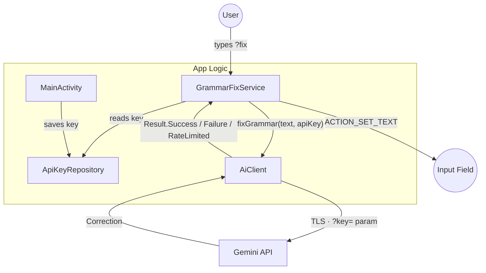

# Architecture — WordWise

**Date**: 20-06-2026

## Overview

WordWise is a system-wide accessibility-based utility that provides grammar correction across all Android applications. It operates by monitoring text changes via an `AccessibilityService`, detecting a specific trigger shortcut (`?fix`), and using Google Gemini to perform corrections.

## Component Map

| Component | File | Description |
|---|---|---|
| **GrammarFixService** | `GrammarFixService.kt` | The core AccessibilityService. Listens for `TYPE_VIEW_TEXT_CHANGED` events, matches `?fix` suffix via `Regex("\\?fix$")`, dispatches correction requests to AiClient, and replaces text on the UI node via `ACTION_SET_TEXT`. Runs on `Dispatchers.Main` with a `SupervisorJob` scope. |
| **AiClient** | `AiClient.kt` | Singleton managing a shared `OkHttpClient` (4.12.0) and the Google Gemini backend (`gemini-2.5-flash-lite`). Exposes `suspend fun fixGrammar(text: String, apiKey: String): Result` which switches to `Dispatchers.IO` internally. The `Result` sealed class has three variants: `Success`, `RateLimited`, `Failure`. |
| **ApiKeyRepository** | `ApiKeyRepository.kt` | Secure storage for a single Gemini API key using `EncryptedSharedPreferences` (AES-256-SIV for key encryption, AES-256-GCM for value encryption). Reads and writes the key under `api_key_gemini` in a preferences file named `secret_keys`. |
| **MainActivity** | `MainActivity.kt` | Launcher activity with ViewBinding. Provides the API key text input, a clickable link to Google AI Studio, a Save button backed by `ApiKeyRepository`, and a live accessibility service status indicator (Enabled/Disabled) updated in `onResume`. |

## Flow Diagram

## Key Design Decisions

- **Accessibility vs. IME**: WordWise uses an AccessibilityService instead of a custom Input Method Editor (IME) to remain keyboard-agnostic. Users can keep using Gboard, SwiftKey, or any other keyboard.
- **Gemini only**: Google Gemini (`gemini-2.5-flash-lite`) is the sole AI provider. The free tier supports approximately 1,500 requests/day.
- **Strict prompt**: The system uses the instruction: "Return only the corrected text. Preserve the original language and meaning exactly. Do not add any explanations, commentary, or quotation marks."
- **OkHttp Singleton**: A shared `OkHttpClient` is used in `AiClient` to take advantage of connection pooling and keep the app's memory footprint low. Timeouts: connect 30s, read 60s, write 30s.
- **No Local DB**: To minimize complexity and security surface area, WordWise uses only `EncryptedSharedPreferences`. No SQLite/Room database is present.
- **No ViewModel**: The app uses a minimal Activity + Service pattern with ViewBinding. There are no `ViewModel`, `LiveData`, or `StateFlow` classes.
