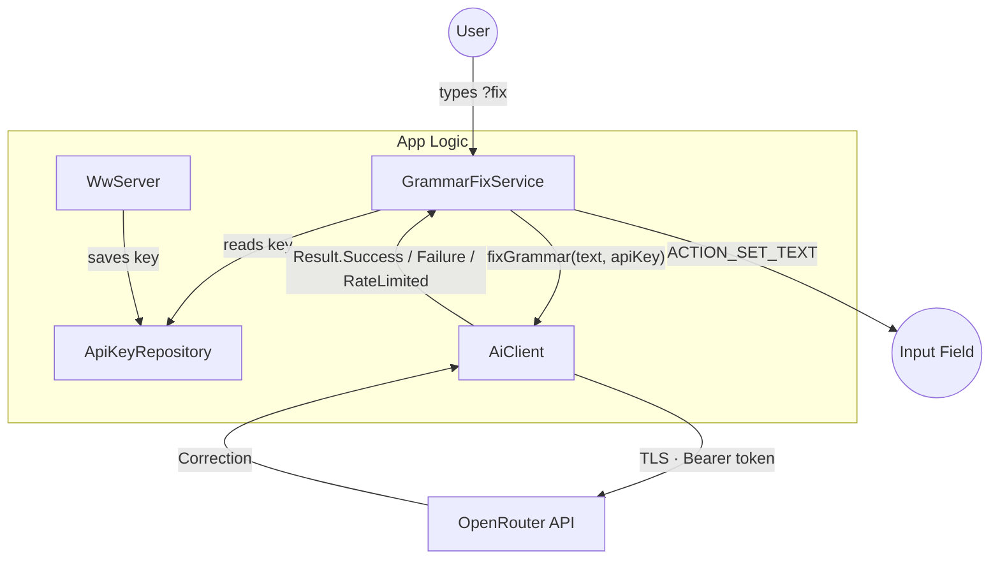

# Architecture — WordWise

**Date**: 12-09-2026

## Overview

WordWise is a system-wide accessibility-based utility that provides grammar correction across all Android applications. It operates by monitoring text changes via an `AccessibilityService`, detecting a specific trigger shortcut (`?fix`), and using OpenRouter's free models router (`openrouter/free`) to perform corrections.

## Component Map

| Component | File | Description |
|---|---|---|
| **GrammarFixService** | `GrammarFixService.kt` | The core AccessibilityService. Listens for `TYPE_VIEW_TEXT_CHANGED` events, matches `?fix` suffix via `Regex("\\?fix$")`, dispatches correction requests to AiClient, and replaces text on the UI node via `ACTION_SET_TEXT`. Runs on `Dispatchers.Main` with a `SupervisorJob` scope. |
| **AiClient** | `AiClient.kt` | Singleton managing a shared `OkHttpClient` (4.12.0) and the OpenRouter backend. Exposes `suspend fun fixGrammar(text: String, apiKey: String): Result` which switches to `Dispatchers.IO` internally and authenticates via the `Authorization: Bearer` header. Includes `HTTP-Referer` and `X-Title` headers for OpenRouter rankings. |
| **ApiKeyRepository** | `ApiKeyRepository.kt` | Secure storage for a single OpenRouter API key using `EncryptedSharedPreferences` (AES-256-SIV for key encryption, AES-256-GCM for value encryption). Reads and writes the key under `api_key_openrouter` in a preferences file named `secret_keys`. |
| **WwServer** | `WwServer.kt` | Embedded Ktor (CIO) server on localhost:8977 serving the htmx frontend and REST settings API. Routes: `GET /` (shell), `GET /screens/home`, `GET /screens/about`, `POST /api/key`, `POST /api/settings/theme`. |
| **Views** | `Views.kt` | Server-rendered HTML screens (home, about) in the WordWise pastel design system. The home screen includes key input, model badge, theme picker, and usage instructions. |
| **Prefs** | `Prefs.kt` | Non-secret app settings (theme only) in plain SharedPreferences. |

## Flow Diagram

```mermaid
graph TD
    User((User)) -- types ?fix --> GFS[GrammarFixService]

    subgraph App Logic
        GFS -- reads key --> AKR[ApiKeyRepository]
        GFS -- fixGrammar(text, apiKey) --> AIC[AiClient]
        WS[WwServer] -- saves key --> AKR
    end

    AIC -- TLS · Bearer token --> OR[OpenRouter API]
    OR -- Correction --> AIC
    AIC -- Result.Success / Failure / RateLimited --> GFS
    GFS -- ACTION_SET_TEXT --> Field((Input Field))
```

## Key Design Decisions

- **Accessibility vs. IME**: WordWise uses an AccessibilityService instead of a custom Input Method Editor (IME) to remain keyboard-agnostic. Users can keep using Gboard, SwiftKey, or any other keyboard.
- **Single provider**: OpenRouter's free models router (`openrouter/free`) is the sole AI backend — auto-routes to available free models.
- **Strict prompt**: The system uses the instruction: "Return only the corrected text. Preserve the original language and meaning exactly. Do not add any explanations, commentary, or quotation marks."
- **OkHttp Singleton**: A shared `OkHttpClient` is used in `AiClient` to take advantage of connection pooling and keep the app's memory footprint low. Timeouts: connect 15s, read 60s, write 30s.
- **No Local DB**: To minimize complexity and security surface area, WordWise uses only `EncryptedSharedPreferences`. No SQLite/Room database is present.
- **No ViewModel**: The app uses a minimal Activity + Service pattern with ViewBinding. There are no `ViewModel`, `LiveData`, or `StateFlow` classes.
- **Embedded web UI**: Settings UI is a localhost Ktor server serving htmx pages, accessed via the "Settings" link in MainActivity.
